## MLP XOR

1. 최종 결과 O를 출력했을 때 결과가 [ 0, 1, 1, 0 ]에 근접하기 때문에 XOR 연산을 만족하는 것을 알 수 있다.

   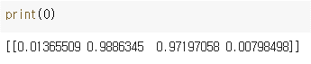

2. loss trace 그래프는 다음과 같다. 

   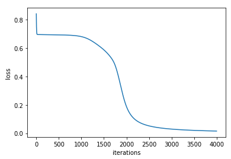

 

3. Iteration 횟수는 4000, learning rate는 0.1로 4번의 학습 결과를 출력했다. 

   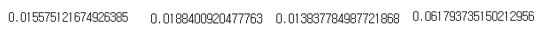

   같은 조건으로 학습을 해도 최종 loss는 조금씩 다르다. 랜덤한 숫자로 initialize 하기 때문에 학습이 반복되면서 최종 결과 값은 비슷해 지지만 완전히 같은 값이 나오지는 않는것을 확인할 수 있다.

4. Loss가 0.02 미만이 되는 지점의 iteration 횟수를 확인해보면,

   learning rate = 0.5일 때 iteration 854번째에, learning rate = 0.1일 때 iteration 3268번째에, learning rate = 0.01일 때 iteration 32391번째에 loss가 0.02 미만이 되었다.

   Learning rate에 따라 학습되는 속도가 달라지기 때문에 learning rate가 클수록 적은 iteration 횟수로도 loss가 0.02 미만에 도달하는 것을 확인할 수 있다.

5. Weight와 bias를 모두 0으로 initialize 되도록 코드를 수정하고 결과를 다시 출력했다.

   Loss trace, 최종 loss, 결과인 O를 순서대로 출력한 결과이다.

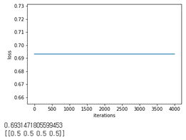

## CNN Implementation from Scratch - MNIST dataset

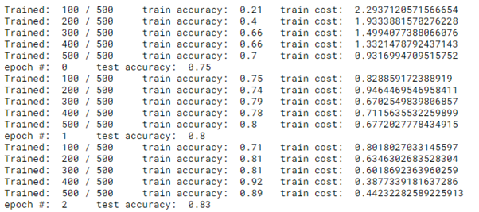

## RNN Implementation from Scratch

Hyperparameter를 변경하기 이전 학습 결과는 다음과 같다. Epoch 1000번을 돌아 최종적으로 training loss는 약 5.62, test loss는 약 0.19가 출력된 것을 확인할 수 있다. 

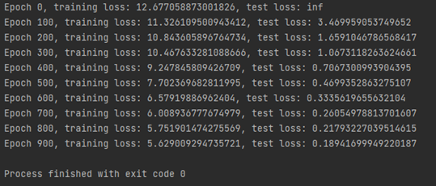

Learning rate를 1e-3으로 변경 후 학습 결과는 다음과 같다. 

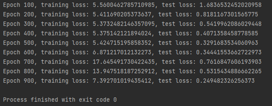

## CNN Implementation using TensorFlow

코랩 환경에서 CPU를 사용했을 때 학습에 걸리는 시간과, GPU를 사용했을 때 학습에 걸리는 시간이다.

GPU로 실행했을 때가 실행 속도가 빠른 것을 확인 할 수 있는데, 이는 GPU가 CPU와 달리 parallel computing이 가능하기 때문이다. CPU와 달리 하나의 instruction으로 여러 개의 연산을 동시에 수행할 수 있기 때문에 CPU보다 에너지 효율도 높고 속도도 빠르다. 

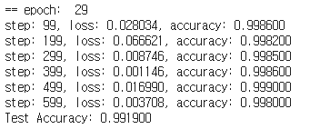

CNN 구조 변경 전 구조로 실행한 결과 마지막 epoch의 출력 결과를 캡처한 사진이다. 최종 training accuracy는 0.998, test accuracy는 0.992가 나오는 것을 확인 할 수 있다.

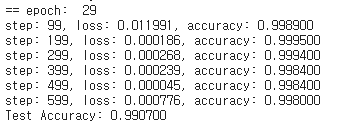

변경 후 출력 결과이다. training accuracy는 약 0.998, test accuracy는 약 0.991이 나왔다. 정확도는 변경 전 코드와 거의 유사하게 나왔고, training 속도는 더 오래 걸렸다. 최종 training loss는 변경 전보다 낮아졌다. 

## 2 Layer Neural Network with CIFAR-10 dataset

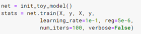

Toy model을 위와 같은 파라미터로 학습시킨다. 

학습이 반복되면서 loss는 점점 감소해 최종 loss는 약 0.017이 되었고, iteration마다 loss를 누적하여 기록한 loss_history를 출력한 결과이다. 

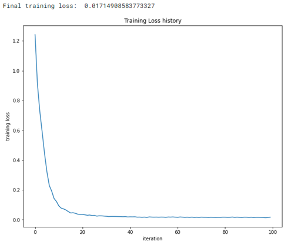

이제 CIFAR-10 데이터셋을 불러와 학습을 진행해보자.

데이터셋의 모양을 확인해보면, get_CIFAR10_data (num_training = 19000,  num_validation = 1000, num_test = 1000) 로 파라미터를 정했기 때문에 이에 따라 결과가 출력된다. 

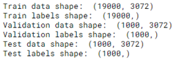

num_iters=100, batch_size=200, learning_rate=1e-4, learning_rate_decay=0.95, reg=0.25로 cifar-10 데이터셋을 학습시킨 결과이다.

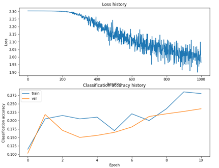

그래프를 보면 loss가 감소하고 있지만 위에서 구했던 toy model의 loss history 그래프와는 많이 다르다. 또한 train accuracy와 validation accuracy 그래프도 전체적으로는 증가하고 있지만 그래프의 모양이 예쁘게 나오지 않는다. 보통 학습이 잘 된 모델의 그래프는 train accuracy가 valid accuracy 보다 위에서 떨어져서 올라가고, 들쑥날쑥하면서 올라가지도 않는다. 

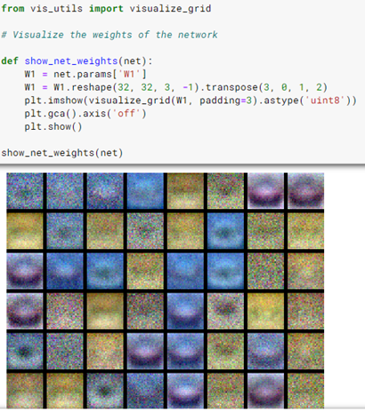

network의 weight를 visualize하여 출력한 결과다. 위에서 출력한 결과들을 볼 때 학습 시킨 model의 capacity가 낮다고 볼 수 있다. 

 

regularization_strengths, training epoch 횟수, learning rate 같은 파라미터의 값을 변경하여 다른 결과를 구할 수 있다. 즉 최적의 결과를 얻기 위한 파라미터를 구해야 한다. 

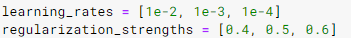

위와 같이 배열에 테스트할 값을 담고, 아래의 코드를 이중 for문을 돌면서 각각의 조합에 따른 결과를 비교해 best_stats, best_val, best_net을 구했다. 

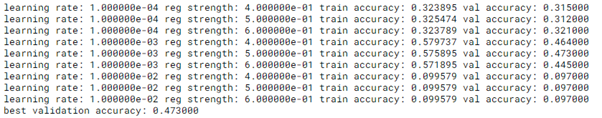

learning rate 3개, regularization strength 3개에 대해 for문을 돌렸기 때문에 총 9번의 for문을 돌면서 그 중 best를 구한다. 그 중 최적의 값을 best_val에 저장해 두었기 때문에 이 값을 출력하면 0.462를 구할 수 있다. Hyperparameter tuning 과정 이전의 결과와 비교하면 정확도가 많이 오른 것을 확인 할 수 있다. 

best_net의 출력 결과는 다음과 같다. 

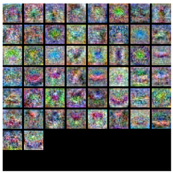

## VGG-16 and ResNet50

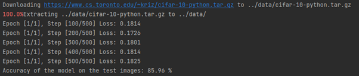

VGG로 CIFAR-10 데이터셋을 학습시켰다. Epoch는 1회, learning_rate = 0.001, batch_size = 100로 설정했다.

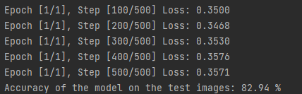

Resnet도 마찬가지로 Epoch는 1회, learning_rate = 0.001, batch_size = 100로 학습시켰다. 참고로 이 코드는 일반적으로 쓰이는 resnet50과는 구조가 약간 다르게 작성했다.

## UNET 

그냥 unet 코드와 encoder 부분에서 resnet50 구조를 사용한 resnet_encoder_unet이 있다. 